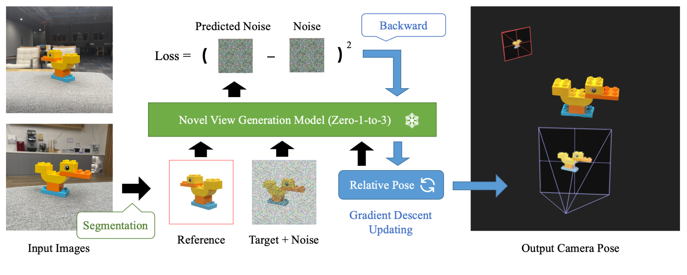

# ID-Pose: Sparse-view Camera Pose Estimation by Inverting Diffusion Models [Arxiv](#) | [Page](https://xt4d.github.io/id-pose/)

## Abstract
Given sparse views of an object, estimating their camera poses is a long-standing and intractable problem. We harness the pre-trained diffusion model of novel views conditioned on viewpoints (Zero-1-to-3). We present ID-Pose which inverses the denoising diffusion process to estimate the relative pose given two input images. ID-Pose adds a noise on one image, and predicts the noise conditioned on the other image and a decision variable for the pose. The prediction error is used as the objective to find the optimal pose with the gradient descent method. ID-Pose can handle more than two images and estimate each of the poses with multiple image pairs from triangular relationships. ID-Pose requires no training and generalizes to real-world images. We conduct experiments using high-quality real-scanned 3D objects, where ID-Pose significantly outperforms state-of-the-art methods.
