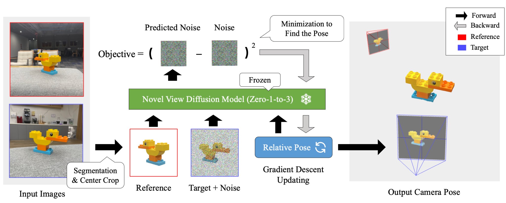
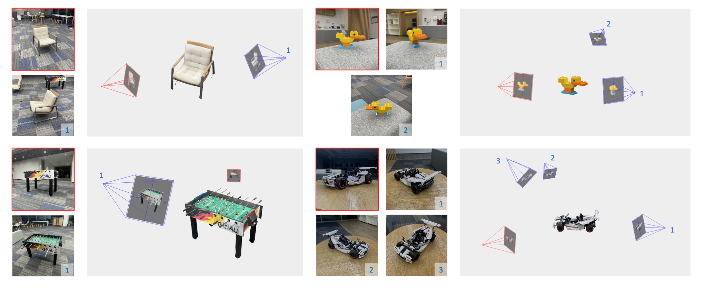

# ID-Pose: Sparse-view Camera Pose Estimation by Inverting Diffusion Models 



[<a href="https://arxiv.org/abs/2306.17140" target="_blank">Paper</a>] | [<a href="https://xt4d.github.io/id-pose-web/" target="_blank">Project Page</a>] | [<a href="https://xt4d.github.io/id-pose-web/viewer.html" target="_blank">Interactive Examples</a>]

## TL;DR
- ID-Pose estimates camera poses of sparse input images (>= 2).
- ID-Pose inversely uses a view-conditioned diffusion model [Zero-1-to-3](https://zero123.cs.columbia.edu/) to find poses (no training required).
- ID-Pose generalizes to in-the-wild images as leveraging diffusion models pre-trained on large-scale data. 

## News
- [2023-11-12] We incoporate "absolute elevation estimation" as the default setting. We update the default values of the following parameters: ```--probe_min_timestep```, ```--probe_max_timestep```, ```--min_timestep```, ```--max_timestep```. 
- [2023-09-11] We introduce a new feature that initializing relative poses with estimated absolute elevations from input images. The estimation method and the source code are borrowed from [One-2-3-45](https://one-2-3-45.github.io/). This feature improves the metrics by about 3%-10% (tested on OmniObject3D). It also reduces the running time as elevations will not be probed. 
- [2023-09-11] We release the evaluation data & code. Please check the [Evaluation](#evaluation) section.
## Usage
### Installation
Create an environment with Python 3.9 (Recommend to use [Anaconda](https://www.anaconda.com/download/) or [Miniconda](https://docs.conda.io/en/latest/miniconda.html))
```
git clone https://github.com/xt4d/id-pose.git
cd id-pose/
pip install -r requirements.txt
git clone https://github.com/CompVis/taming-transformers.git
pip install -e taming-transformers/
git clone https://github.com/openai/CLIP.git
pip install -e CLIP/
```

### Download checkpoints
1. Download `105000.ckpt` from [Zero123 weights](https://huggingface.co/cvlab/zero123-weights/tree/main) to `ckpts/`.
```
mkdir -p ckpts/
wget -P ckpts/ https://huggingface.co/cvlab/zero123-weights/resolve/main/105000.ckpt
```
2. Download `indoor_ds_new.ckpt` from [LoFTR weights](https://drive.google.com/drive/folders/1xu2Pq6mZT5hmFgiYMBT9Zt8h1yO-3SIp) to `ckpts/`.
### Run examples
Running requires around 28 GB of VRAM on an NVIDIA Tesla V100 GPU.
```
python test_pose_estimation.py --input_json ./inputs/omni3d.json --exp_name omni3d
```
The results will be stored under `outputs/` with the name specified by ```--exp_name```.

### Visualization
```
pip install jupyterlab
jupyter-lab viz.ipynb
```
### Evaluation
The evaluation data can be downloaded from [Google Drive](https://drive.google.com/file/d/1EU5D_enpxPTPaZHq9DDS2roninBULqEx/view?usp=sharing). Put the input json files under `inputs/` and the dataset folders under `data/`.

Run pose estimations on each dataset:
```
python test_pose_estimation.py --exp_name abo_tset --input_json inputs/abo_testset.json --bkg_threshold 0.9
python test_pose_estimation.py --exp_name omni3d_tset --input_json inputs/omni3d_testset.json --bkg_threshold 0.5
``` 
Run the evaluation script as:
```
python metric.py <outputs/exp_name/> <data/dataset_name/>
```

## Use your own data
Step 1: Create a folder with subfolders `images_raw/` and `masks/`. For example:
```
mkdir -p data/demo/lion/
mkdir -p data/demo/lion/images_raw/
mkdir -p data/demo/lion/masks/
```
Step 2: Put the images under `images_raw/`. The image files should be named with numbers. For example:
```
lion
├── images_raw
    ├── 000.jpg
    ├── 001.jpg
```

Step 3: Put the masks of the images under `masks/`. The mask files should be assigned the same numerical names as their associated images. And a mask should have the same size as its associated image. For example:
```
lion
├── images_raw
    ├── 000.png
    ├── 001.png
```

Step 4: Run the script `crop_obj.py` to crop the images:
```
python scripts/crop_obj.py --root data/demo/lion/
```
The results will be stored under `images/`.

Step 5: Create a JSON file containing testing samples, with each one includes an anchor view and a number of target views. The structure of the file can be referred from the example [demo.json](inputs/demo.json).

Step 6: Run estimation:
```
python test_pose_estimation.py --input_json ./inputs/demo.json --exp_name demo
```
The results will be stored under `outputs/demo/`.

## Examples


The images outlined in <span style="color:red">red</span> are anchor views for which the camera poses have been manually found.

👉 Open <a href="https://xt4d.github.io/id-pose-web/viewer.html" target="_blank">Interactive Viewer</a> to check more examples.

## Work in progress
- 3D reconstruction with posed images.
- Reduce the running time of ID-Pose.
- Upgrade ID-Pose to estimate 6DOF poses.


##  Citation
```
@article{cheng2023id,
  title={ID-Pose: Sparse-view Camera Pose Estimation by Inverting Diffusion Models},
  author={Cheng, Weihao and Cao, Yan-Pei and Shan, Ying},
  journal={arXiv preprint arXiv:2306.17140},
  year={2023}
}
```
